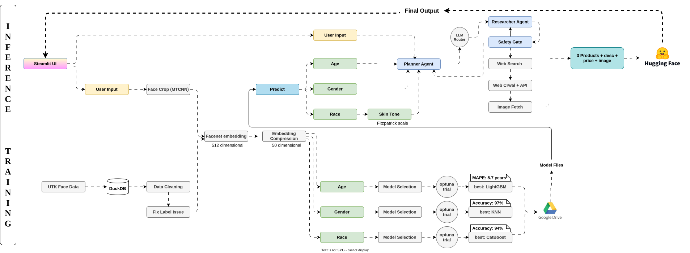

# SkinWise AI

An AI-powered personalized skincare recommendation system that combines facial analysis with an agentic research pipeline to deliver safe, evidence-based product routines.


## Overview

SkinWise AI predicts demographics (age, gender, ethnicity) from a face photo, then uses an **agentic AI orchestrator** to research skin concerns, discover ingredients, find real purchasable products from multiple sources, and validate safety before returning a personalized skincare routine.

## Key Features

- **Facial Analysis**: Deep learning models predict age, gender, and ethnicity from photos
- **Agentic Research Pipeline**: Automated LangGraph-based workflow with multiple sub-agents
- **Multi-Source Product Discovery**: Searches Aistack, Open Beauty Facts, and SerpAPI
- **LLM Safety Gate**: Validates products against pregnancy, allergies, and sensitivities
- **Multi-Provider LLM Router**: Automatic failover across 4+ LLM providers
- **Evidence-Grounded**: Research backed by search results, not hallucinations
- **Configurable**: All prompts, models, and settings via YAML
- **Web UI**: Streamlit interface with Docker support

## Quick Start

### Prerequisites
- Python 3.11.14
- API keys for at least one LLM provider

### Installation

```bash
git clone https://github.com/Prithwijit24/skinwise-ai.git
cd skinwise-ai
pip install -r requirements.txt
```

### Configuration

Create a `.env` file:

```env
# LLM Providers (at least one required)
AGNES_API_KEY=your_key_here
OPENCODE_API_KEY=your_key_here
LLM7IO_API_KEY=your_key_here
ORACLELLM_API_KEY=your_key_here

# Product Search (optional, enables images/prices)
SERP_API_KEY=your_serpapi_key
AISTACK_BASE_URL=your_aistack_url
AISTACK_API_KEY=your_aistack_key

# LangSmith (optional tracing)
LANGSMITH_API_KEY=your_key_here
```

### Run

```bash
# Web UI
streamlit run src/project_folder/app.py

# CLI Test
python scripts/api_runner.py --preset app-f

# Docker
docker build -t skinwise-ai .
docker run -p 7860:7860 --env-file .env skinwise-ai
```

## Architecture



```
User Photo → Face Detection → Demographics (Age/Gender/Ethnicity)
                                        ↓
                              Skincare Questionnaire
                                        ↓
                    ┌─────────────────────────────────────┐
                    │     Agentic Orchestrator (LangGraph) │
                    │  ┌─────────────────────────────────┐│
                    │  │ 1. research_skin_concerns       ││
                    │  │ 2. research_ingredients        ││
                    │  │ 3. find_products (3 sources)    ││
                    │  │ 4. check_contraindications     ││
                    │  └─────────────────────────────────┘│
                    │         ↓ Safety Gate ↓             │
                    │  ┌─────────────────────────────────┐│
                    │  │ 5. Final Routine (3 products)   ││
                    │  └─────────────────────────────────┘│
                    └─────────────────────────────────────┘
                                        ↓
                              Personalized Routine JSON
```

## Project Structure

```
├── config/
│   └── api_config.yml          # All configuration (providers, prompts, safety rules)
├── src/project_folder/
│   ├── agentic/                # Core recommendation engine
│   │   ├── models.py           # Pydantic schemas for LLM outputs
│   │   ├── orchestrator.py     # LangGraph state machine
│   │   ├── products.py         # Multi-source product discovery
│   │   ├── research.py         # Research sub-agents
│   │   ├── safety.py           # LLM safety gate
│   │   ├── providers.py        # Multi-provider LLM router
│   │   ├── session.py          # User profile builder
│   │   ├── tools.py            # LangChain tools
│   │   ├── config.py           # Config loader
│   │   ├── aistack.py          # Search/crawl client
│   │   └── questionnaire.py    # Static questionnaire
│   ├── app.py                  # Streamlit web UI
│   └── main.py                 # Demographic prediction ML pipeline
├── scripts/
│   └── api_runner.py           # CLI test harness
├── tests/agentic/              # 37 unit tests
├── Dockerfile
└── pyproject.toml
```

## Configuration

All settings in `config/api_config.yml`:

```yaml
orchestrator:
  max_turns: 14              # Max planner turns
  max_safety_retries: 2      # Safety gate retries
  routine_size: 3            # Products per routine
  recursion_limit: 80        # LangGraph limit

products:
  default_budget: medium
  budget_limits:
    low: 30.0               # USD
    medium: 90.0            # USD
    high: .inf

providers:
  agnes:
    planner_model: agnes-2.0-flash
    worker_model: agnes-2.0-flash
  # ... 3 more providers
```

## Product Discovery Pipeline

Three-tier cascading search:

1. **Aistack Search** (free/cheap) - Primary product source
2. **Open Beauty Facts** (free) - Open database fallback
3. **SerpAPI Google Shopping** (paid) - Price + image enrichment

Images extracted from:
- Open Graph (`og:image`) meta tags
- Direct product image URLs
- Page content parsing

## Safety Gate

LLM-powered safety validation checks:
- **Pregnancy**: Blocks tretinoin, retinol, isotretinoin, salicylic acid, benzoyl peroxide
- **Fragrance Sensitivity**: Blocks fragrance, parfum
- **General Sensitivity**: Advisory for sensitive skin

Fail-open design: LLM failure does not block the routine.

## LLM Provider Router

Multi-provider failover with automatic degradation:

| Provider | Planner Model | Worker Model | Timeout |
|----------|--------------|--------------|---------|
| Agnes | agnes-2.0-flash | agnes-2.0-flash | 60s |
| OpenCode | deepseek-v4-flash-free | big-pickle | 60s |
| LLM7IO | gpt-oss:20b | codestral-latest | 60s |
| OracleLLM | deepseek-r1-80k | deepseek-r1-80k | 300s |

## API Usage

```python
from project_folder.agentic import orchestrate

result = orchestrate(
    demographics={"age_range": "25-34", "sex": {"value": "F"}, "race": {"value": "Asian"}},
    answers={"skin_type": "Combination", "budget": "medium", "pregnant": "no"},
    session_id="unique-id"
)

# Returns:
# {
#     "session_id": "unique-id",
#     "routine": [
#         {
#             "product_name": "...",
#             "url": "https://...",
#             "price": "$24.99",
#             "ingredient": "Niacinamide",
#             "reasoning": "Detailed 50+ word explanation...",
#             "image_url": "https://..."
#         }
#     ],
#     "concerns_addressed": ["UV sensitivity", "Hyperpigmentation"],
#     "disclaimer": "Cosmetic recommendations only..."
# }
```

## Testing

```bash
python -m pytest tests/ -v
```

**37 tests** covering:
- Product discovery and budget filtering
- Research sub-agents
- Safety gate validation
- Provider router failover
- Orchestrator state machine

## Tech Stack

- **AI/ML**: LangGraph, LangChain, TensorFlow, Keras
- **LLMs**: Agnes, OpenCode, LLM7IO, OracleLLM (OpenAI-compatible)
- **Search**: SerpAPI, Aistack, Open Beauty Facts
- **Data**: Pydantic, DuckDB, Pandas
- **UI**: Streamlit, OpenCV
- **Infra**: Docker, LangSmith (optional)

## License

Private project - All rights reserved.
